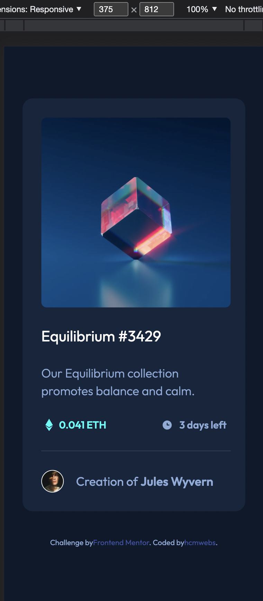
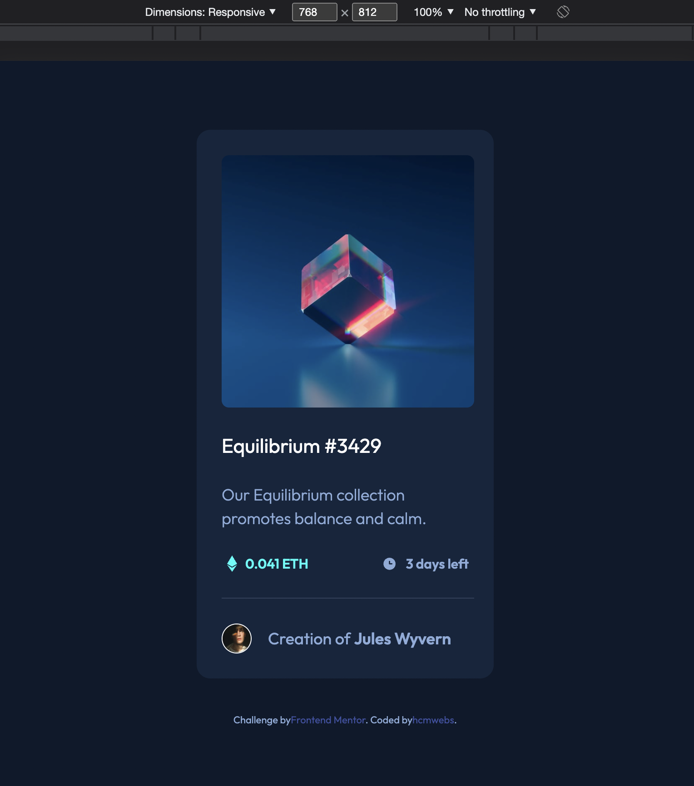
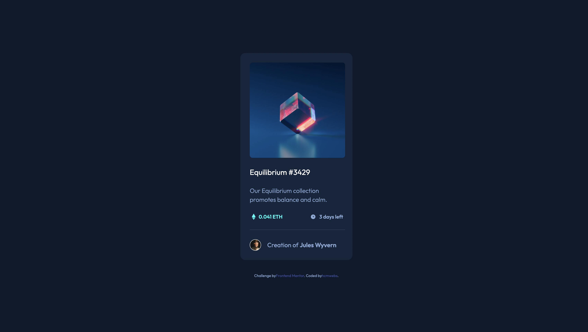

# Frontend Mentor - NFT preview card component solution

This is a solution to the [NFT preview card component challenge on Frontend Mentor](https://www.frontendmentor.io/challenges/nft-preview-card-component-SbdUL_w0U). Frontend Mentor challenges help you improve your coding skills by building realistic projects.

## Table of contents

- [Overview](#overview)
  - [The challenge](#the-challenge)
  - [Screenshot](#screenshot)
  - [Links](#links)
- [My process](#my-process)
  - [Built with](#built-with)
  - [What I learned](#what-i-learned)
  - [Continued development](#continued-development)
  - [Useful resources](#useful-resources)
- [Author](#author)
- [Acknowledgments](#acknowledgments)

## Overview

### The challenge

Users should be able to:

- View the optimal layout depending on their device's screen size
- See hover states for interactive elements

### Screenshot

### Links

- Solution URL: [Here is my solution](https://www.frontendmentor.io/solutions/project-done-with-react-and-sass-Pw8_BFWDk/report)
- Live Site URL: [Here is the site live](https://nft-preview-rho.vercel.app/)

### Built with

- Semantic HTML5 markup
- CSS custom properties
- Flexbox
- CSS Grid
- Mobile-first workflow
- [React](https://reactjs.org/) - JS library
- [Dart sass](https://sass-lang.com/) - For styles
- [7-1 pattern ](https://sass-guidelin.es/#architecture) - to structure the scss files

### What I learned

- The use of pseudo elements ::before & ::after are very important and easy to use.
- React is so fun to learn.

### Continued development

- Still, I have a lot to learn with React and then Next.Js and MERN .

### Useful resources
- [Stack Overflow](https://stackoverflow.com/) - Every developer's friend.
- [Google](https://www.google.com) - This is always a life a saver.
- [Coding Addict](https://www.johnsmilga.com/) - John Smilga of Coding addict, has played a vital role in my learning of React. Through his [youtube](https://www.youtube.com/c/CodingAddict) channel as well as [Udemy](https://www.udemy.com/course/react-tutorial-and-projects-course/), John has a lot of great content: JS, react  and so many projects for one to practice with.

## Author

- Website - [hcmwebs](https://www.hcmwebs.com)
- Frontend Mentor - [@hcmwebs](https://www.frontendmentor.io/profile/Hcmwebs)
- Twitter - [@hcmwebs](https://twitter.com/hcmwebs)

## Acknowledgments
- [Frontendmentor](https://www.frontendmentor.io/) - Thank you very much for creating this platform.
- [@john_smilga](https://twitter.com/john_smilga) - Special thanks for your time and your content. It is easy to follow and understand.